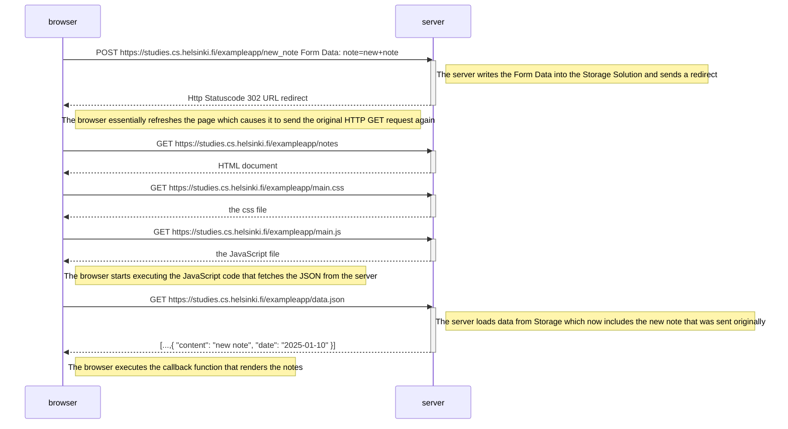

```mermaid
sequenceDiagram
    participant browser
    participant server

    browser->>server: POST https://studies.cs.helsinki.fi/exampleapp/new_note Form Data: note=new+note
    activate server
    Note right of server: The server writes the Form Data into the Storage Solution and sends a redirect
    server-->>browser: Http Statuscode 302 URL redirect
    deactivate server

    Note right of browser: The browser essentially refreshes the page which causes it to send the original HTTP GET request         again

    browser->>server: GET https://studies.cs.helsinki.fi/exampleapp/notes
    activate server
    server-->>browser: HTML document
    deactivate server


    browser->>server: GET https://studies.cs.helsinki.fi/exampleapp/main.css
    activate server
    server-->>browser: the css file
    deactivate server

    browser->>server: GET https://studies.cs.helsinki.fi/exampleapp/main.js
    activate server
    server-->>browser: the JavaScript file
    deactivate server

    Note right of browser: The browser starts executing the JavaScript code that fetches the JSON from the server

    browser->>server: GET https://studies.cs.helsinki.fi/exampleapp/data.json
    activate server
     Note right of server: The server loads data from Storage which now includes the new note that was sent originally
    server-->>browser: [...,{ "content": "new note", "date": "2025-01-10" }]
    deactivate server

    Note right of browser: The browser executes the callback function that renders the notes

```
