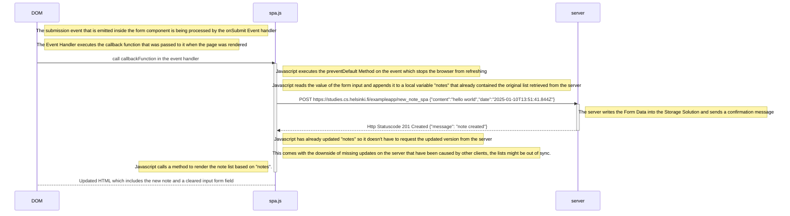

```mermaid
sequenceDiagram
    participant DOM
    participant spa.js
    participant server

    Note right of DOM: The submission event that is emitted inside the form component is being processed by the onSubmit Event handler
    Note right of DOM: The Event Handler executes the callback function that was passed to it when the page was rendered
    DOM->>spa.js: call callbackFunction in the event handler
    activate spa.js
    Note right of spa.js: Javascript executes the preventDefault Method on the event which stops the browser from refreshing
    Note right of spa.js: Javascript reads the value of the form input and appends it to a local variable "notes" that already contained the original list retrieved from the server
    spa.js->>server: POST https://studies.cs.helsinki.fi/exampleapp/new_note_spa {"content":"hello world","date":"2025-01-10T13:51:41.844Z"}
    activate server
    Note right of server: The server writes the Form Data into the Storage Solution and sends a confirmation message
    server-->>spa.js: Http Statuscode 201 Created {"message": "note created"}
    deactivate server
    Note right of spa.js: Javascript has already updated "notes" so it doesn't have to request the updated version from the server
    Note right of spa.js: This comes with the downside of missing updates on the server that have been caused by other clients, the lists might be out of sync.
    Note left of spa.js: Javascript calls a method to render the note list based on "notes".
    deactivate spa.js
    spa.js-->DOM: Updated HTML which includes the new note and a cleared input form field
```
